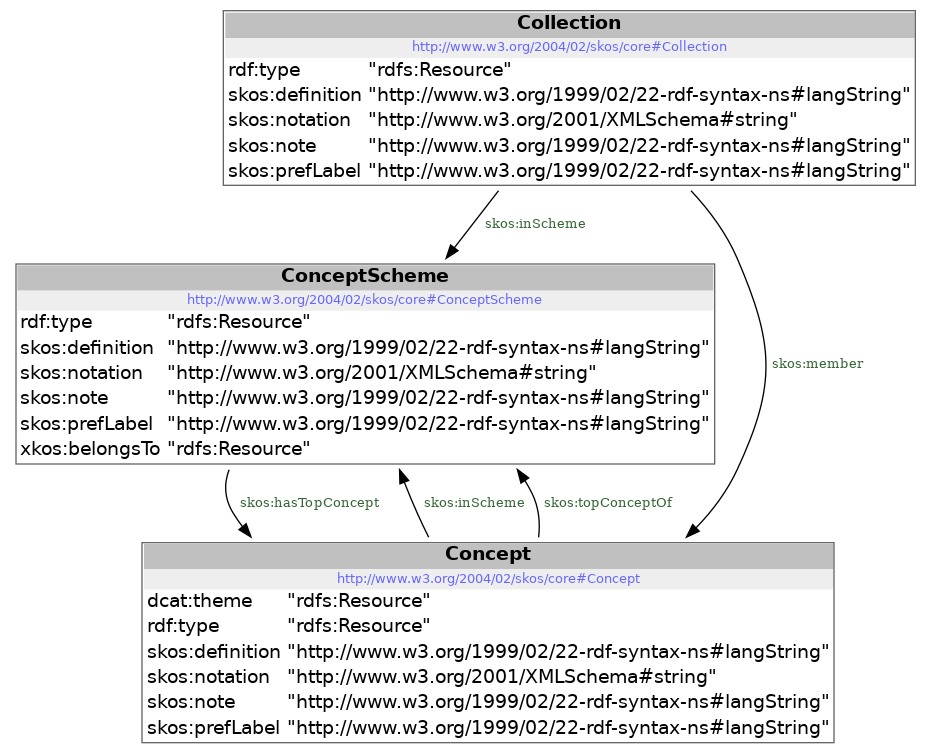

# codelijst-emissie

## Samenvatting
Lijst van types emissie, zoals die binnen het kader van het OSLO thema omgeving is opgesteld en tools om deze lijst te beheren en om te zetten naar webformaten.

## Projectinhoud
In dit project worden de bron bestanden en de verschillende verspreidingsvormen van de codelijst beheerd.
Het project bevat ook tools om deze lijst te beheren en om te zetten naar webformaten.

## Model

## Gebruik

### Voeg een definitie van een nieuwe type emissie toe aan $PROJECT_HOME/src/source/codelijst-source.csv

### Voer het het transformatiescript uit:
```
cd $PROJECT_HOME/src/
node 01_codelijst_skos_from_csv.js
```

### run een maven build ( testen worden uitgevoerd en metadata aangemaakt)
```
cd $PROJECT_HOME
mvn clean install
```

## Dependencies

**_nodejs_**

### Installeer nodejs en npm
```
apt-get install node
apt-get install npm
```

### Installeer libraries in package.json
```
cd $PROJECT_HOME
/usr/bin/node /usr/lib/node_modules/npm/bin/npm-cli.js install --scripts-prepend-node-path=auto
```

